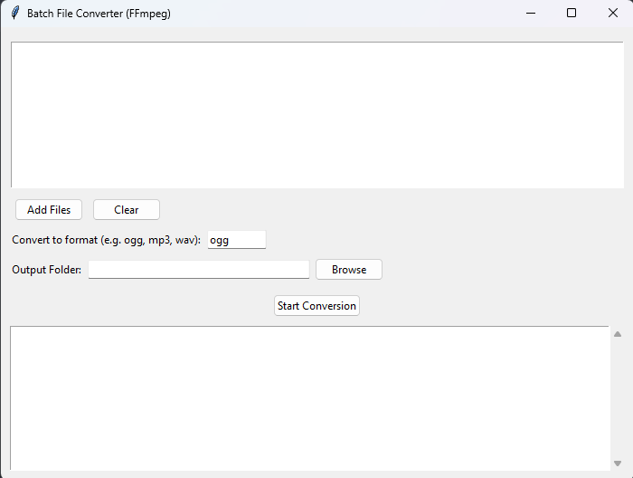

# 🎧 Batch File Converter (FFmpeg GUI)

A simple Python GUI tool to batch convert audio/video files into any format using FFmpeg.



## ✨ Features
- Select multiple files
- Convert to any format (ogg, mp3, wav, etc.)
- Choose output directory
- Real-time logging
- Simple and lightweight (no external dependencies)

## 🛠 Requirements
- Python 3.x
- FFmpeg installed and added to PATH

### Install FFmpeg
Download from: https://ffmpeg.org/download.html

Verify installation:
```bash
ffmpeg -version
```

## 📦 Installation
```bash
git clone https://github.com/your-username/your-repo-name.git
cd your-repo-name
```

(Optional: create virtual environment)
```bash
python -m venv venv
source venv/bin/activate  # Linux/macOS
venv\\Scripts\\activate     # Windows
```

## ▶️ Run
```bash
python main.py
```

## 📸 Usage
1. Click **Add Files**
2. Enter output format (e.g., ogg)
3. Select output folder
4. Click **Start Conversion**

## 💡 Tips
- Use `.ogg` for games (best compression + looping)
- Use `.wav` for short sound effects
- Ensure FFmpeg is correctly installed

## 🚀 Future Improvements
- Drag & drop support
- Progress bars
- Bitrate/quality controls
- Presets for game development